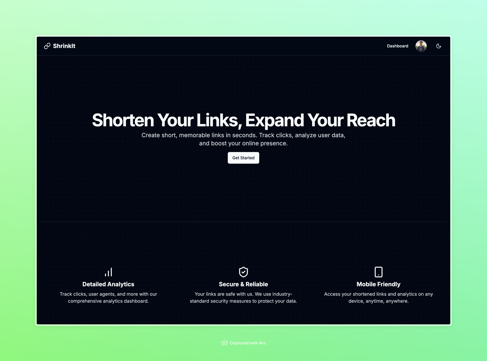
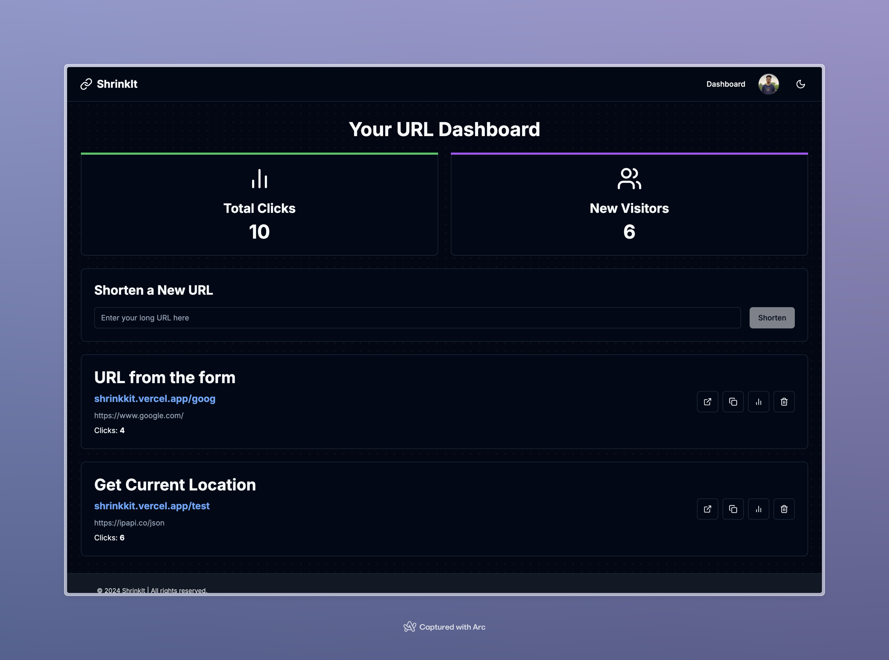
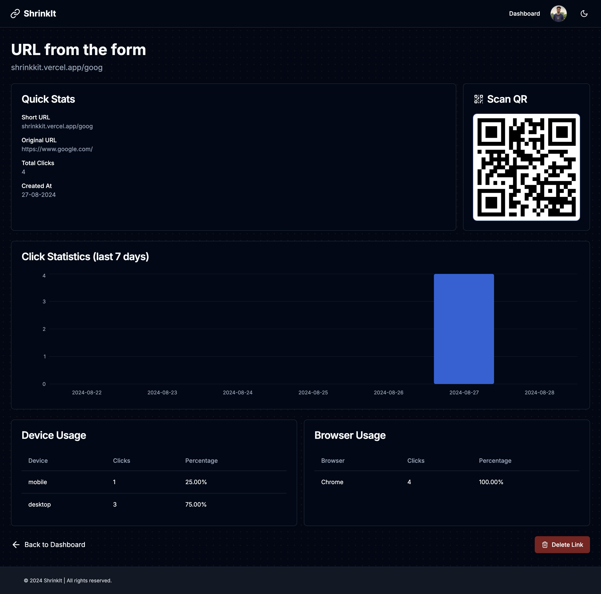
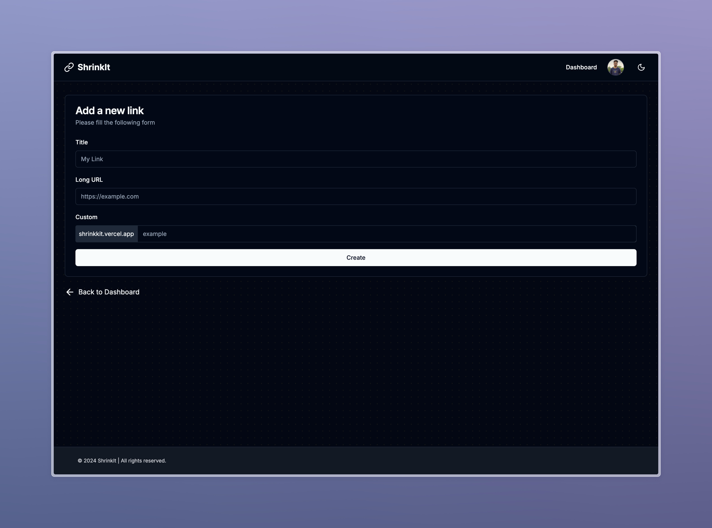
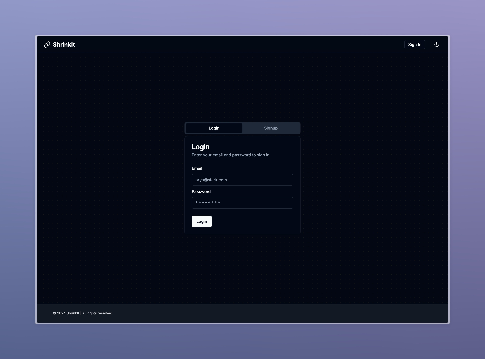
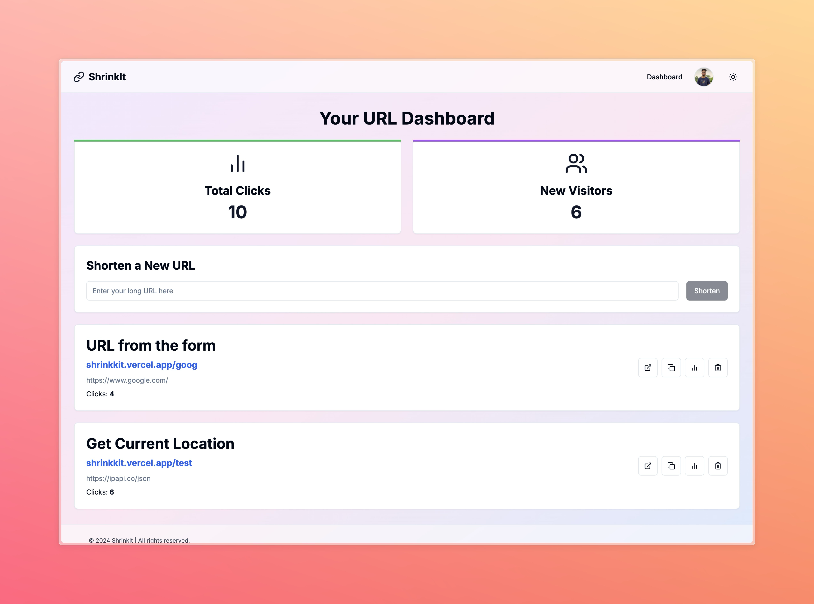

# URL Shortener

A Next.js project for shortening URLs.

## Overview

This project is a simple URL shortening application built with Next.js. It allows users to enter a long URL and generate a shortened version. The application also provides analytics on the number of clicks for each shortened URL.

## Features

- URL Shortening: Users can enter a long URL and the application will generate a shortened version.
- URL Analytics: Users can view click statistics for each shortened URL.
- User-friendly Interface: The application provides an intuitive interface for creating, editing, and deleting shortened URLs.

## Technologies Used

- Next.js
- React
- Supabase
- Lucide React
- Tailwind CSS
- Shadcn UI

## Getting Started

To get started with the project, follow these steps:

1. Clone the repository:

   ```bash
   git clone https://github.com/khalil-codes/url-shortener-next.git
   ```

2. Install dependencies:

   ```bash
   npm install
   ```

3. Set up environment variables:

   - Create a `.env` file in the root directory of the project.
   - Add the following environment variables:
     ```
     NEXT_PUBLIC_SUPABASE_URL=<your-supabase-url>
     NEXT_PUBLIC_SUPABASE_ANON_KEY=<your-supabase-anon-key>
     ```

4. Start the development server:

   ```bash
   npm run dev
   ```

5. Open the application in your browser:
   - Visit [http://localhost:3000](http://localhost:3000) to see the application in action.

## Contributing

If you'd like to contribute to this project, please follow these steps:

1. Fork the repository.
2. Create a new branch for your changes.
3. Make your changes.
4. Commit and push your changes.
5. Submit a pull request.

## License

This project is licensed under the MIT License.

## Screenshots

### Landing Page



### Dashboard



### Analytics



### Shorten URL Form



### Login/Signup



### Light Mode



## Additional Information

For more information about the project, you can refer to the following resources:

- [Next.js Documentation](https://nextjs.org/docs)
- [Supabase Documentation](https://supabase.com/docs)
